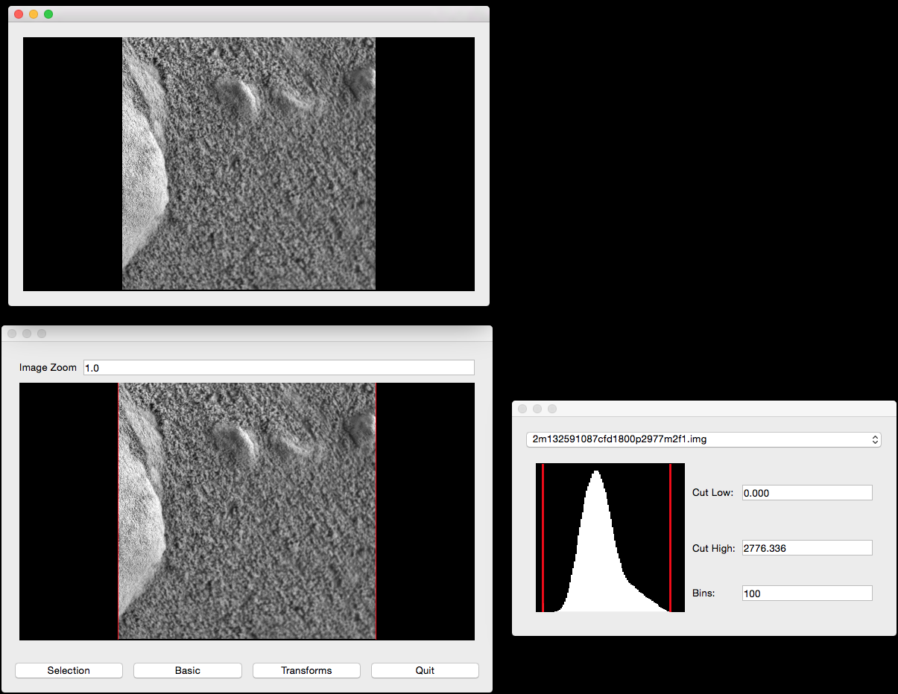
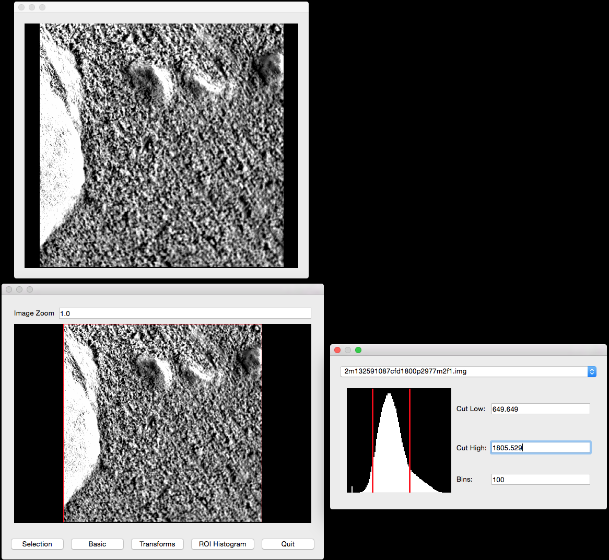
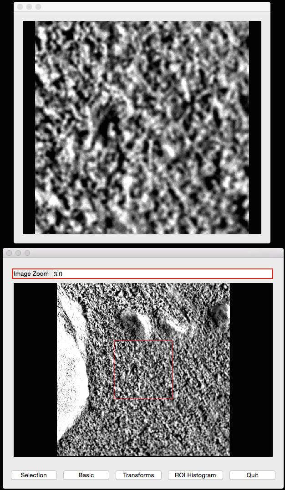
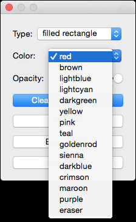
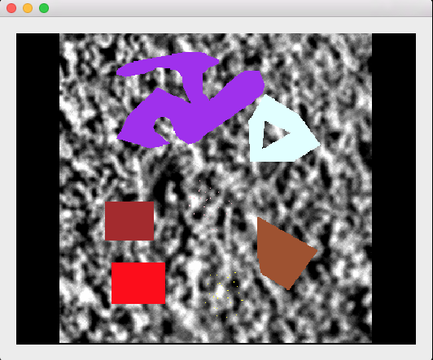
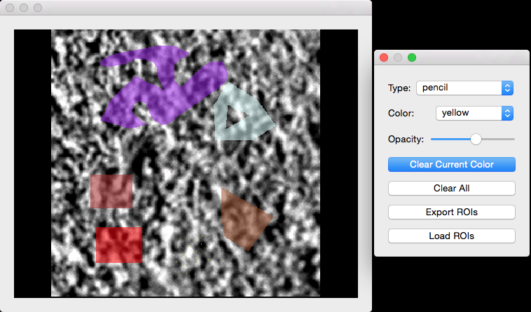

===============================================================
pdsspect - A Python PDS Image Region of Interest Selection Tool
===============================================================

**NOTE:** This is Alpha quality software that is being actively developed, use
at your own risk.  This software is not produced by NASA.

* Free software: BSD license
* Documentation: https://pdsspect.readthedocs.org.

Features
--------

* NASA PDS Image Viewer

**NOTE:** This is alpha quality software.  It lacks many features and lacks
support for many PDS image types.  This software is not produced by NASA.

Install
-------

On OS X you must first install the Qt UI toolkit using Homebrew
(http://brew.sh/).  After installing Homebrew, issue the following command::

    brew install qt

Create a new virtual environment, install the `pdsspect` module with git,
and setup the PySide environment. You must install either PySide, PyQt5, or
PyQt4 as well (recommend PyQt5)::

    Make a clone of ``pdsspect`` and change to main directory. We recommend
    making a virtual environment for to install ``pdsspect`` in.

    pip install -e .
    pip install PyQt5

Now you should be able to run the `pdsspect` program.

This works on Linux as well (Ubuntu 14.04).  Instructions coming soon.

Quick Tutorial
--------------

Open an image in the command line::
    
    pdsspect tests/mission_data/2m132591087cfd1800p2977m2f1.img

This will open the default window:

The bottom left window is considered the main window. In this window, the user
can adjust the position of the pan and open other windows. The bottom right
window is the ``basic`` window. Pressing the ``basic`` button will open this
window if closed. However, it starts out open. In this window, the user can
change the image in the views and adjust the cut levels by either moving the
red lines or typing in the numbers in the cut boxes:

The top window is the ``pan window`` which displays the data in the main
window's red box. The main function of this window is to make Region of
Interest (ROI) selections.

In the ``zoom`` box in the main window, the user can change the size of the box
and the data in the pan view:

the mouse wheel can also be used to change the zoom. Rolling the wheel foward
and backwards will adjust the zoom amount by ``+1`` or ``-1`` respectively.
The user can adjust the position of the box by clicking in the main window
where the center of the pan should be. Using the arrow keys will also adjust
the position of the box by ``1`` in the direction of the arrow key.

Clicking the ``Selection`` button will open the ``Selections Window``:

.. image:: screenshots/selection_window.png

In this window, the user can change the ROI selection type:

.. image:: screenshots/selection_types.png

and change the ROI color:

Furthermore, in this window, the user can clear the current color or clear all
ROIs. Most importantly, the user can export ROIs to ``.npz`` files. These files
contain boolean masks and of the images and a list of files open at the time
of export. For example, to see the data in an example file
``selections_ex.npz``, use `numpy load method
<https://docs.scipy.org/doc/numpy-1.13.0/reference/generated/numpy.load.html>`_
to view and utilize data.

.. code-block:: python

    >>> import numpy as np
    >>> with np.load('selections_ex.npz') as selections:
    ...     red = selections['red']
    ...     print(np.where(red))
    ...     print(red.dtype)
    ...     print(red.shape)
    ...     print(selections['files'])
    ...     print(selections.files)
    ...
    (
        array([384, 384, 384, ..., 429, 429, 429]),
        array([398, 399, 400, ..., 454, 455, 456])
    )
    bool
    (1024, 1024)
    ['2m132591087cfd1800p2977m2f1.img']
    [
        'purple',
        'pink',
        'files',
        'eraser',
        'sienna',
        'goldenrod',
        'brown',
        'yellow', 
        'darkblue',
        'red',
        'lightblue',
        'lightcyan',
        'crimson',
        'maroon',
        'teal',
        'darkgreen'
    ]

The user can also import ROI selections. However the images that are open must
be in the ``files`` list in the ``.npz`` file.

In the pan window, the user can make different types of ROI selections:

Change the opacity of the ROIs using the ``Opacity`` slider in the ``Selections
Window``:

Note that when opening multiple images at the same time, it is best practice
that they are all the same shape. Otherwise the images will have the smallest
common shape and not look as expected (i.e., If when loading two images where
one image has a shape of ``(63, 36)`` and the other image has a shape of
``(24, 42)``, the displayed shape will be ``(24, 36)``. This will cause the
first image to have the right side cut off and the second image to have the
top cut off). This is done so all ROIs created can apply to the entire list
of images. To avoid this behavior, either only open images that have the same
shape or open images one at a time.
